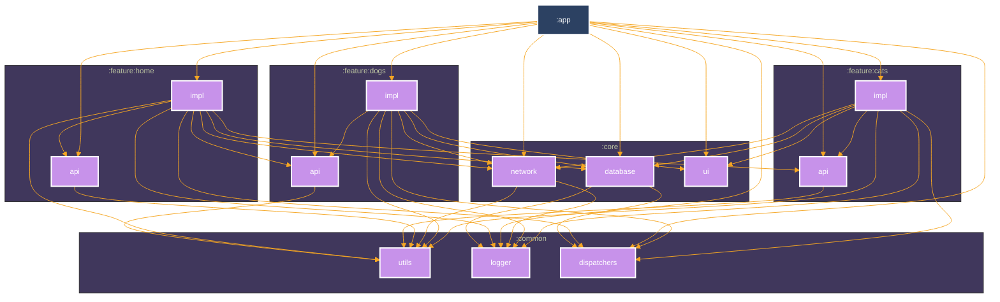

# ThePets

## About
Compose Multiplatform application simply loads data from API and stores it in persistence storage (i.e. SQLite Database).
* User real  [Cats](https://thecatapi.com) and [Dogs](https://dog.ceo/dog-api) api. 
* Clean and Simple Material UI. 
* Use multi-module Gradle architecture. 

## Built With 🛠
[Kotlin](https://kotlinlang.org/) - First class and official programming language for Android development. 
[Kotlin Gradle DSL](https://docs.gradle.org/current/userguide/kotlin_dsl.html) - Provides an alternative syntax to the traditional Groovy DSL for Gradle build system.  
[Coroutines](https://kotlinlang.org/docs/reference/coroutines-overview.html) - Kotlin Asynchronous or non-blocking programming. 
[Compose](https://developer.android.com/develop/ui/compose/documentation) - The modern toolkit for building native Android UI. 
[ViewModel](https://developer.android.com/topic/libraries/architecture/viewmodel) - Stores UI-related data that isn't destroyed on UI changes. 
[Voyager](https://voyager.adriel.cafe) - Component helps you implement navigation. 
[Room](https://developer.android.com/topic/libraries/architecture/room) - SQLite object mapping library. 
[Koin](https://insert-koin.io) - The pragmatic Kotlin Dependency Injection framework. 
[Ktor](https://ktor.io) - A type-safe Kotlin Multiplatform HTTP client. 
[Kotlin Serialization](https://kotlinlang.org/docs/serialization.html)) - A modern JSON library for Kotlin and Java. 

## Module Graph

## Architecture
This repository uses recommended Android [App architecture](https://developer.android.com/topic/architecture).
